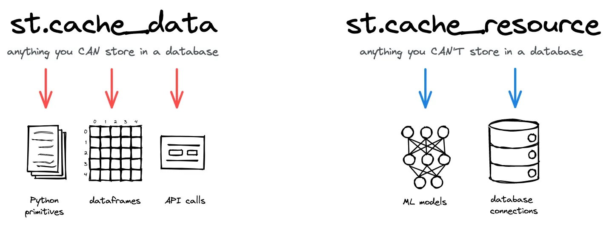

+++
title = 'Streamlit Cache 활용 방법'
date = 2024-09-06
draft = false
author = ['이성호(Tommie)']
tags = ['STREAMLIT']
image = 'https://miro.medium.com/v2/resize:fit:1400/1*9F4yTGOTrN2EwE_EVQWNmg.png'
slug = 'streamlit-cache'
description = 'Streamlit의 st.cache_data와 st.cache_resource 사용법, TTL과 max_entries 설정으로 서버 메모리 부족 문제를 해결하는 캐시 최적화 방법을 공유합니다.'
+++

- 참고문서
    
    https://docs.streamlit.io/develop/concepts/architecture/caching#controlling-cache-size-and-duration
    

<aside>
<b>💡 문제사항</b>

Streamlit에서 데이터를 빠르게 불러오기 위해 @st.cache_.. 를 사용하고 있습니다.하지만 사용자가 많아질수록 서버의 메모리 부족으로 인해 멈추는 현상이 발생하고 있습니다.

</aside>

따라서 @st.cache_..의 사용 변경사항에 대해 공유드리려고 합니다.

**요약된 결론을 먼저 코드로 보여드리고, 아래에 사용 방식과 이유에 대해 설명해 놓았습니다.** 참고 부탁드립니다.

## 💪st.cache 변경 방식 (결론)

```python
# 데이터를 불러와 변경가능성이 있는 경우 (대부분 해당 방식 사용)
@st.cache_data

# 데이터 변환이 없는 경우
@st.cache_resource

# 캐시된 리소스의 유효 기간을 설정 (예시)
@st.cache_data(ttl=3600)  # 👈 데이터를 1시간동안 캐시에 저장 (=3600 seconds)
def decide_pax_position(group, terminal):
    _, location, detail = group.name
    group = group.sort_values(by="QueueStart")
    ...
    return group
    
    
# 캐시되는 데이터의 최대 항목 수를 설정 (예시)
@st.cache_resource(max_entries=3) # 👈 최대 3번까지 캐시에 데이터를 저장
def load_aircraft_ref():
    df = pd.read_excel("data/ref/OAG_REF.xlsx", sheet_name="Aircraft Code")
    ...
    return df

# 두 방식 전부 사용
@st.cache_resource(ttl=3600, max_entries=3) # 👈 최대 3번까지 캐시에 데이터를 저장
def load_aircraft_ref():
    df = pd.read_excel("data/ref/OAG_REF.xlsx", sheet_name="Aircraft Code")
    ...
    return df
```

해당 방식을 사용하지 않을경우 메모리에 캐시데이터가 계속 쌓이게 되어서 메모리 사용량이 초과할 수 있습니다.

## 🦻st.cache의 사용 용도별 설명

### st.cache_data와 st.cache_resource의 사용 사례

 

1. st.cache_data
    
    데이터와 같은 값이나 결과를 캐싱할 때 사용합니다. 주로 계산된 결과나 외부 API에서 받아온 데이터를 캐싱하여 성능을 향상시키고, 동일한 요청이 반복될 때 빠르게 응답할 수 있도록 합니다.
    
    - 대부분의 사용 사례에 적합합니다.
    - 캐시 데이터를 복사해서 사용하기 때문에 원본 캐시 데이터에 영향을 주지 않습니다.

1. st.cache_resource
    
    모든 사용자, 세션 및 재실행에서 전역적으로 사용할 수 있는 "리소스"를 캐시할때 사용됩니다.
    
    리소스를 재사용할 때 초기화 비용이 크거나, 다시 만들기 어렵거나 비효율적인 경우에 좋습니다.
    
    - 특히 데이터베이스 연결 및 ML 모델을 경우의 사용 사례가 대부분으로 사용이 제한적입니다.
    - 캐시 데이터를 그대로 사용해서 변형하기 때문에 원본 캐시 데이터에 영향을 주게 됩니다.

- 주요 사용 사례 목록 (참고 자료)
   - https://docs.streamlit.io/develop/concepts/architecture/caching#deciding-which-caching-decorator-to-use

---

### st.cache 기능의 매개변수 2가지

<aside>
💡 해당 방식은 항상 이용자의 수와 메모리 크기에 따라 사이값이 변동될 수 있습니다! 참고만 부탁드려요.
</aside>

1. TTL (Time-To-Live)
    
    TTL은 **캐시된 데이터나 리소스의 유효 기간**을 설정하는 매개변수입니다. 캐시된 항목이 TTL에 설정된 시간이 지나면 자동으로 만료되고, 이후 해당 함수를 호출하면 새롭게 데이터를 계산하거나 리소스를 생성하게 됩니다.
    
    추천상황
    
    - 자주 업데이트되고 변하는 데이터의 경우 TTL을 5분 ~ 1시간으로 설정합니다.
    - 잘 변하지 않는 데이터의 경우 TTL을 1시간 이상 ~ 며칠씩 설정합니다.
    - 영구적인 데이터(ex. st.cache_resource)의 경우 TTL 설정을 하지 않습니다.

1. max_entries
    
    **캐시할 항목의 최대 개수**를 제한하는 매개변수입니다. 캐시에 저장된 항목의 수가 max_entries를 초과하면, 가장 오래된 항목부터 삭제되고 새로운 항목이 추가됩니다.
    
    추천상황
    
    - **대규모 데이터셋, 복잡한 계산 결과** 등을 캐싱하는 상황의 경우 max를 5 ~ 50 까지로 설정합니다.
    - 캐싱되는 데이터가 작고, 다양한 입력에 대한 캐시가 필요할 때. 예를 들어, **소규모 API 호출 결과**나 **가벼운 계산 결과**를 자주 캐싱하는 상황의 경우 max를 100 ~ 1000까지로 설정합니다.

---

### 추가 매개변수 2가지 (참고용)

1. show_spinner
    
    기본적으로 Streamlit은 캐시된 함수가 실행 중일 때 앱에 작은 로딩 스피너를 표시합니다.
    
    show_spinner를 사용하면 캐싱 데코레이터 모두에 사용 가능한 매개변수로 쉽게 수정할 수 있습니다.
    

```python
@st.cache_data(show_spinner=False)  # 👈 스피너 가리기
def get_api_data():
    data = api.get(...)
    return data

@st.cache_data(show_spinner="Fetching data from API...")  # 👈 커스텀
def get_api_data():
    data = api.get(...)
    return data
```

1. 입력 매개변수를 캐시에서 제거
    
    함수에서 매개변수 앞에 _를 붙이면 캐시에서 제거된다.
    
    ex. def fetch_data(_db_connection, num_rows):
    
    ```python
    @st.cache_data
    def fetch_data(_db_connection, num_rows):  # 👈 Don't hash _db_connection
        data = _db_connection.fetch(num_rows)
        return data
    
    connection = init_connection()
    fetch_data(connection, 10)
    ```