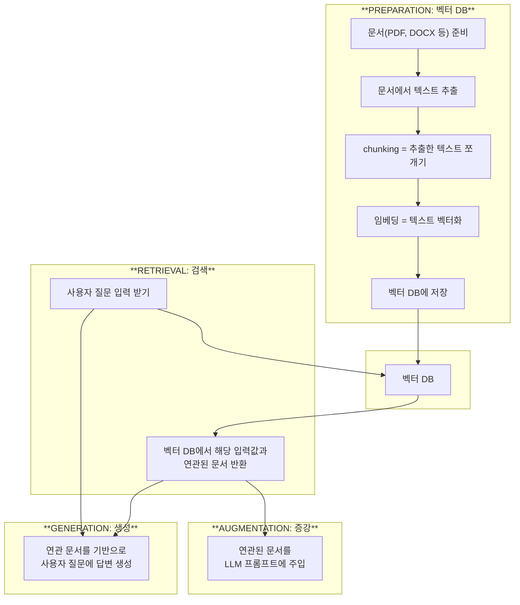
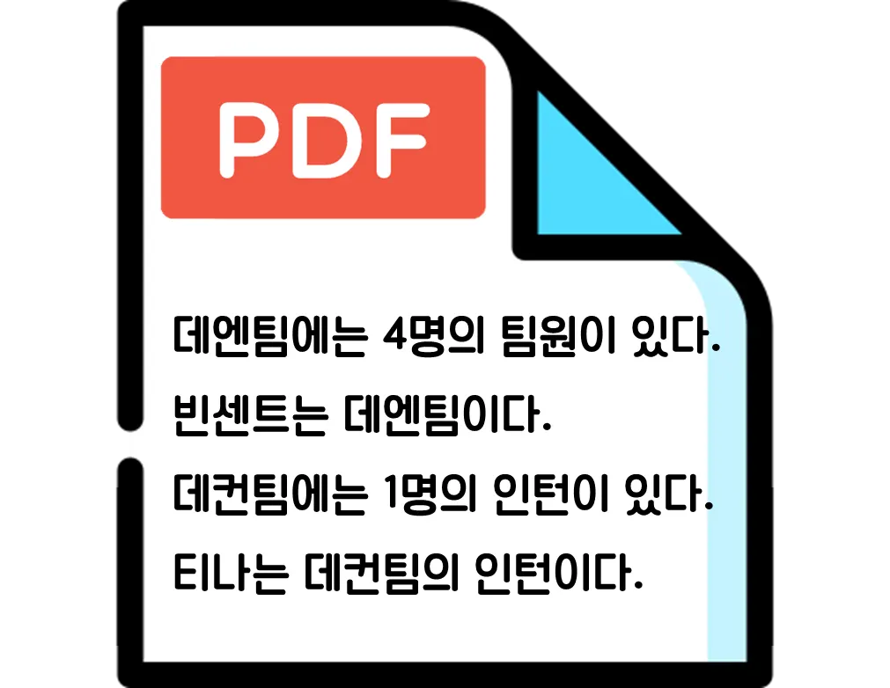

+++
title = '기존 LLM의 문제점과 RAG(Retrieval Augmented Generation)'
date = 2024-10-30
draft = false
tags = ['RAG', 'LLM']
image = 'https://www.hyro.ai/wp-content/uploads/2023/07/RAG.png'
slug = 'rag-llm'
description = 'LLM의 할루시네이션 문제를 해결하는 RAG(Retrieval Augmented Generation)의 개념, 이점, 그리고 벡터 DB를 활용한 일반적인 RAG 구현 과정을 설명합니다.'
+++

# 👻 **기존 LLM의 문제점**

<aside>
<b>🌱 LLM이란?</b>

* Large Language Model
* 방대한 양의 데이터로 사전 학습된 딥러닝 모델 → 자연어 등의 데이터 이해 및 생성
* ex) OpenAI의 GPT, Google의 Gemini, Meta의 LLaMa

</aside>

- hallucination : 허위 정보 제공
- 신뢰할 수 없는 출처로부터 응답 생성
- 용어 혼동으로 인한 부정확한 응답

# 💡 **RAG (Retrieval Augmented Generation)**

- LLM을 리디렉션하여 신뢰할 수 있는 출처에서 관련 정보를 검색
- **검색 (Retrieval)** : 사용자 질문을 외부 문서에서 검색
- **증강 (Augmentation)** : 검색된 자료들이 모델에 전달되어 모델이 추가적인 배경 지식 습득
- **생성 (Generation)** : 입력된 질문과 증강된 정보를 바탕으로 최종 답변 생성

# 🍭 **RAG의 이점**

- **비용 효율성** : 기존 모델을 따로 훈련할 필요 없이 새로운 데이터 적용
- **사용자 신뢰 강화 및 최신 정보 제공** : 명확한 출처로부터 가져오는 최신 정보
- **개발자 제어 강화** : 정보 소스와 접근 권한을 직접 관리하여 유연하게 조정

# 🛠️ **일반적인 RAG 진행 과정**



## **A) PREPARATION: 벡터 DB**

1. **문서(PDF, DOCX 등) 준비**

    
    
2. **문서에서 텍스트 추출**
    ```
    데엔팀에는 4명의 팀원이 있다. 빈센트는 데엔팀이다. 데컨팀에는 1명의 인턴이 있다. 티나는 데컨팀의 인턴이다.
    ```
    
3. **chunking = 추출한 텍스트를 특정 기준으로 쪼개기**
    
    ```
    데엔팀에는 4명의 팀원이 있다. /
    빈센트는 데엔팀이다. /
    데컨팀에는 1명의 인턴이 있다. /
    티나는 데컨팀의 인턴이다.
    ```

4. **임베딩 = 텍스트 벡터화**
    
     
    
    실제로는 훨씬 더 고차원 형태로 벡터화됨
    
5. **벡터 DB에 저장**
    
    
    

## **B) RETRIEVAL: 검색**

1. **사용자 질문 입력 받기**
    
    ```
    빈센트는 어느 팀에 있어?
    ```
    
2. **사용자 질문을 벡터 DB에서 검색**
    
     
    
3. **연관된 문서 반환**
    
    ```
    1. 데엔팀에는 4명의 팀원이 있다.
    2. 빈센트는 데엔팀이다.
    ```
    

## **C) AUGMENTATION: 증강**

- 연관된 문서를 프롬프트에 작성

```
너는 주어진 데이터를 기반으로 사용자 질문을 답변해 주는 도우미야.

<주어진 데이터>
데엔팀에는 4명의 팀원이 있다.
빈센트는 데엔팀이다.

<사용자 질문>
빈센트는 어느 팀에 있어?
```

## **D) GENERATION: 생성**

- 프롬프트에 입력된 사용자 질문과 연관 문서를 기반으로 답변 생성

```
빈센트는 데엔팀에 있습니다.
```